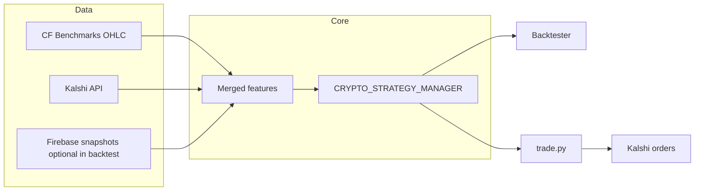

# BTC 15m Kalshi crypto strategy

Research and automation around **Kalshi 15-minute crypto** markets (e.g. `KXBTC15M`): combine **CF Benchmarks–style** spot OHLC, **Kalshi** quotes and order books, and a **rule + Bayesian** stack for entries and exits. The codebase is split into **strategy** (shared logic), **backtester** (offline replay), and **trade** (live loop).

**Author:** Mai He

---

## What this repo does

- **Merges** minute-level crypto reference prices with Kalshi market fields (strike, spreads, etc.) into a single frame used by the strategy.
- **Runs** the same `CRYPTO_STRATEGY_MANAGER` in backtests and in production so thresholds and gates stay aligned.
- **Trades** via the Kalshi REST client (limit entries, managed exits / stop flattening) when you run the live script.



---

## Repository layout

| Path | Purpose |
|------|---------|
| `strategy/` | `MarketContext`, rule classes, Bayesian layer, `models/` (parameters + `joblib` artifacts). |
| `backtester/` | `CRYPTO_STRATEGY_BACKTESTER` — load history, walk rows, accumulate PnL / trade stats. |
| `trade/` | `trade.py` live loop, `generate_ticker.py` (15m event tickers), `order_book.py` helpers. |
| `client/` | `KalshiHttpClient`, signing, REST + WebSocket usage patterns. |
| `lib/` | Firebase + exchange + Kalshi data helpers, `trade_log` formatters. |

Root **`models/`** (if present) may hold additional saved artifacts; the strategy also reads from **`strategy/models/`**.

---

## Strategy (`strategy/`)

Shared between backtest and live trading:

- **`crypto_strategy.py`** — `CRYPTO_STRATEGY_MANAGER`, `MarketContext`, and stacked rules: entry time, entry/exit price, distance to strike, stop time, Bayesian probability threshold, trade side (`yes` / `no`).
- **`crypto_bayesian_strategy.py`** — Gaussian log-odds model over engineered features; parameters from `strategy/models/`.
- **`crypto_pre_strategy.py`**, **`crypto_data_base.py`** — supporting abstractions and data shaping.
- **`models/`** — JSON parameters, `STRATEGY_LOADER` / `LOAD_PARAMETERS` for Bayesian weights and related config.

Live runs emit structured lines through **`lib/trade_log.py`** (market, gates, Bayesian, `TRADE+` / `TRADE-`, API errors).

---

## Backtesting (`backtester/`)

- **`crypto_strategy_backtester.py`** — Builds merged series (Kalshi API + Firebase crypto bars by ticker), iterates bar-by-bar, and runs the same strategy objects as production.
- The **`if __name__ == "__main__"`** block is a **working example**: it filters tickers, calls `get_market_data`, runs `backtester.run()`, and can aggregate win rates / hourly PnL. Adjust ticker filters and date ranges there for your experiment.

Use this path to tune thresholds before enabling real orders.

---

## Production trading (`trade/`)

- **`trade.py`** — Polls data, merges exchange + Kalshi frames, evaluates the manager, and places or closes orders through `client/clients.py`. Strategy knobs at the top of the file (`ENTRY_TIME`, `ENTRY_PRICE`, `THRESHOLD`, etc.) should mirror what you validate in the backtester.
- **`generate_ticker.py`** — Generates candidate **event tickers** from the clock on the 15-minute grid for series like `BTC15M`.
- **`trade_log.txt`** — Default log file (often git-ignored via `*.txt`).

`trade.py` **`__main__`** currently loads **`Environment.PROD`** credentials from `.env` and runs with `series_list=["BTC15M"]`. Change environment or series only after you understand risk and API access.

---

## Setup

**Python:** 3.10+ recommended (uses `zoneinfo`, modern typing).

There is no checked-in `requirements.txt`; install dependencies your environment needs, for example:

```bash
python -m venv .venv
source .venv/bin/activate  # Windows: .venv\Scripts\activate
pip install pandas numpy python-dotenv cryptography requests websockets \
  firebase-admin scipy joblib
```

Clone the repo, then create **`.env`** at the **repository root** (same level as `trade/`, `lib/`). Never commit secrets.

---

## Environment variables (`.env`)

**Kalshi (live / API market data)**

| Variable | Used for |
|----------|----------|
| `PROD_KEYID` / `DEMO_KEYID` | Kalshi API key id |
| `PROD_KEYFILE` / `DEMO_KEYFILE` | Path to PEM private key (absolute or relative to repo root) |

**Firebase (backtester / historical crypto + Kalshi snapshots)**

| Variable | Notes |
|----------|--------|
| `FIREBASE_TYPE`, `FIREBASE_PROJECT_ID`, `FIREBASE_PRIVATE_KEY_ID`, `FIREBASE_PRIVATE_KEY`, `FIREBASE_CLIENT_EMAIL`, `FIREBASE_CLIENT_ID`, `FIREBASE_AUTH_URI`, `FIREBASE_TOKEN_URI`, `FIREBASE_AUTH_PROVIDER_X509_CERT_URL`, `FIREBASE_CLIENT_X509_CERT_URL` | Service-account style JSON flattened into env vars; newlines in `FIREBASE_PRIVATE_KEY` often escaped as `\n`. |
| `FIREBASE_UNIVERSE_DOMAIN` | Optional; defaults to `googleapis.com`. |

CF Benchmarks URLs are resolved in code (`lib/get_data_from_exchange_api.py`); scraped OHLC does not use separate API keys in-repo.

---

## How to run

**Backtest** (from repo root; edit `__main__` ticker list / filters as needed):

```bash
python backtester/crypto_strategy_backtester.py
```

**Live trading** (requires production keys and comfort with real risk):

```bash
python trade/trade.py
```

Run with the **project root** as the working directory (or ensure imports resolve the same way your IDE does: `trade/trade.py` augments `sys.path` with the parent of `trade/`).

---

## Logging

- **`lib/trade_log.py`** — `append_trade_log`, format helpers, default path under `trade/trade_log.txt`.
- Keep logs and keys out of version control; see `.gitignore`.

---

## Disclaimer

This software is for **research and education**. Trading involves risk of loss. You are responsible for API credentials, rate limits, contract specifications, and compliance with **Kalshi**, **CF Benchmarks**, and any other data providers’ terms of use.
